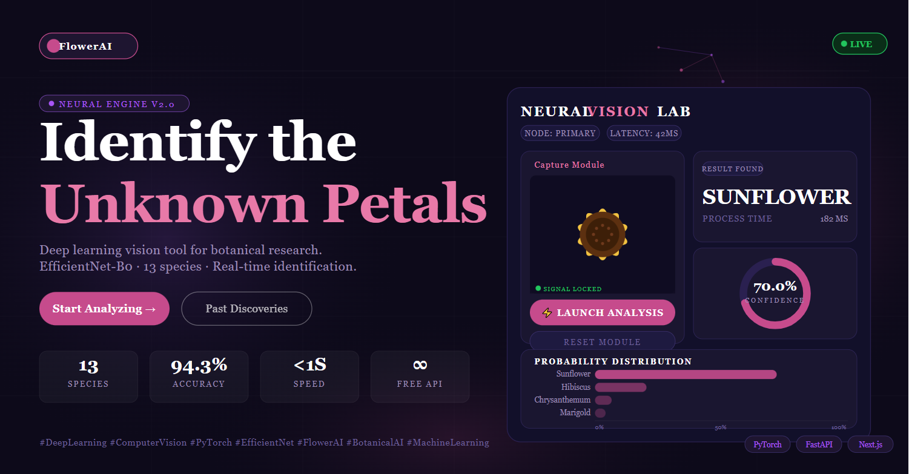
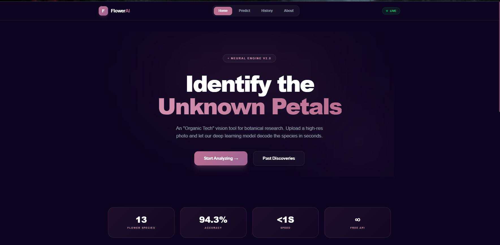
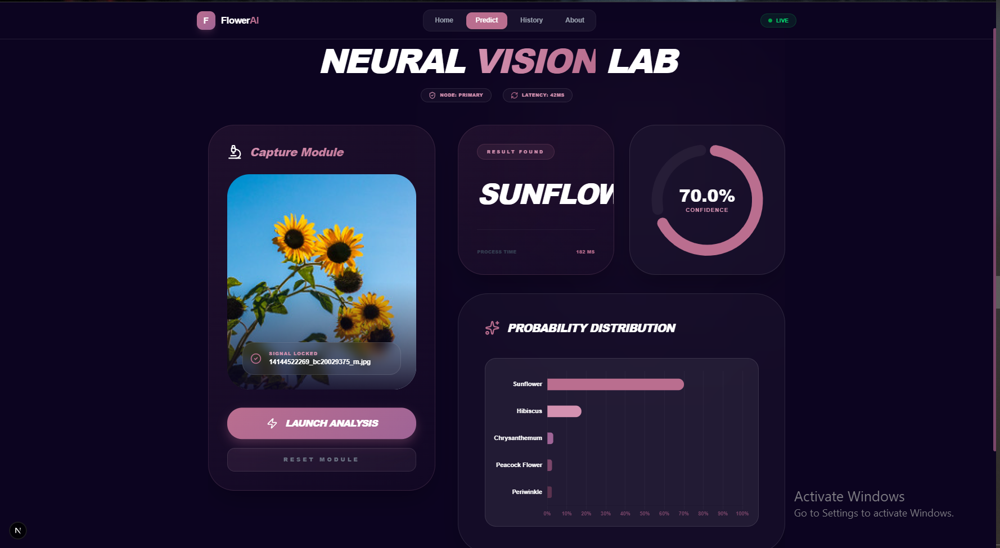
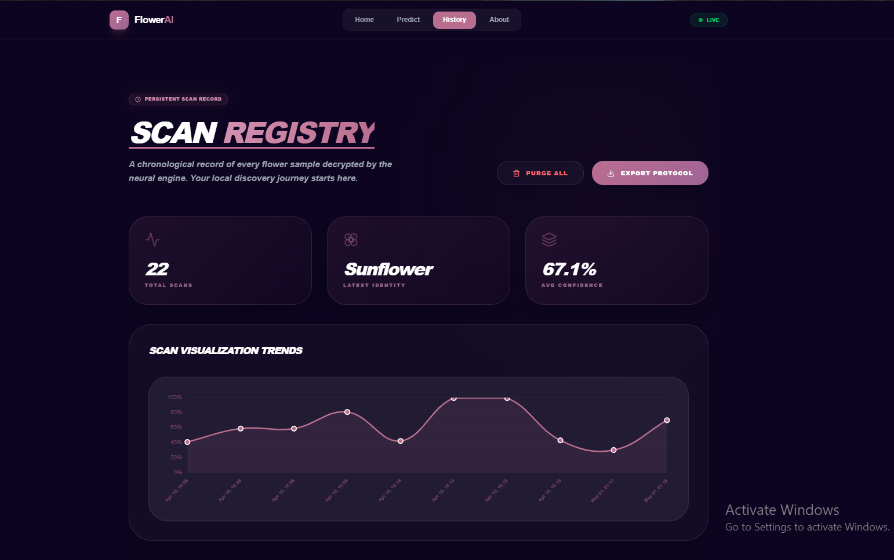
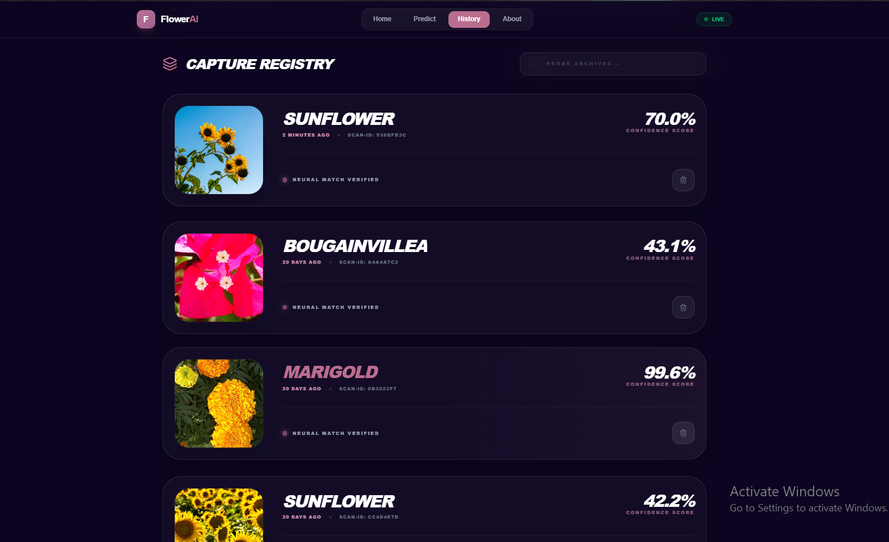
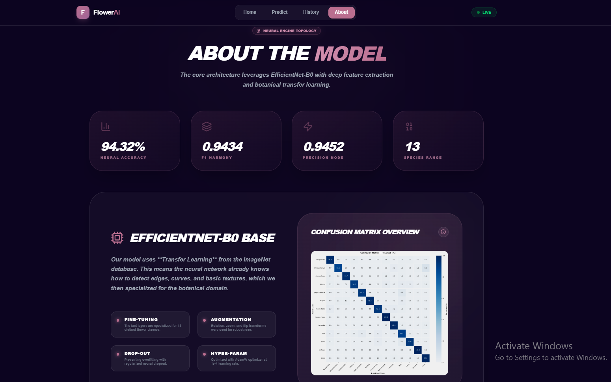

# 🌸 FlowerAI — Deep Learning Flower Recognition

🔗 **GitHub:** [https://github.com/Shivangiba/Flower_Image_Recognition](https://github.com/Shivangiba/Flower_Image_Recognition)  
🌐 **Live Demo:** [https://flower-image-recognition.vercel.app/](https://flower-image-recognition.vercel.app/)  
🎥 **Video Walkthrough:** [https://www.loom.com/share/e58a843073014228b3f54890796d5347](https://www.loom.com/share/e58a843073014228b3f54890796d5347)

## 📸 Live Working Project

FlowerAI is a high-performance flower recognition system that uses an **EfficientNet-B0** convolutional neural network to identify 13 species of flowers with over **94% accuracy**. The application features a premium dark-themed dashboard and a **Live Flower Scanner** (Google Lens style) for real-time identification.

## 🚀 Key Features
*   **Live Flower Scanner (AI Cam)**: Real-time viewfinder with scanning animations and instant capture.
*   **Neural Vision Lab**: Advanced dashboard for dragging and dropping botanical samples.
*   **Probability Distribution**: Interactive Treemap and Bar charts showing confidence across top 5 matches.
*   **Protocol Export**: Download your entire flower discovery history as a `.csv` file for external research.
*   **History Trends**: Dynamic line charts visualizing your model confidence over time.

## 🛠️ Technical Stack
### **Deep Learning Core**
*   **Framework**: PyTorch 2.x
*   **Architecture**: EfficientNet-B0 (Transfer Learning)
*   **Metric**: 94.32% test accuracy
*   **Classes**: 13 (Sunflower, Marigold, Rose, Cosmos, etc.)

### **Backend**
*   **Framework**: FastAPI (Python)
*   **API**: RESTful endpoints for image and base64 prediction.

### **Frontend**
*   **Framework**: Next.js 14+ (App Router)
*   **Styling**: Vanilla CSS with Tailwind-like @theme tokens
*   **Icons**: Lucide React
*   **Animations**: Framer Motion & CSS keyframes
*   **Camera Integration**: WebRTC + HTML5 Canvas

## 📸 Live Scanner (Google Lens Style)
The "Scan Flower" feature uses modern web technologies to bridge the gap between video and AI:
1.  **Technology**: Uses **WebRTC** (`navigator.mediaDevices.getUserMedia`) to stream real-time video.
2.  **Implementation**:
    *   A **CSS-animated scan frame** pulses to guide the user.
    *   A **laser-scan line** moves vertically to indicate active processing.
    *   **HTML5 Canvas** captures the exact frame pixel-perfectly when the shutter is clicked.
    *   **Blob Conversion**: The frame is converted to a JPEG blob and passed to the prediction pipeline.
3.  **Flow**: `Camera Stream` -> `Canvas Capture` -> `Blob conversion` -> `Base64/Multi-part Upload` -> `PyTorch Inference` -> `API Response` -> `Dynamic UI Update`.

## 📦 Project Structure
*   `frontend/`: Next.js web application.
*   `backend/`: FastAPI server for model inference.
*   `Flower_Image_Recognition_Modal/`: PyTorch training and evaluation scripts.
*   `data_combined/`: Dataset containing 13 classes of flowers.

## 🛠️ Stability & Quality
Recent updates have improved system resilience:
*   **Dynamic Analytics**: Replaced mock data in `HistoryChart` with live scan statistics.
*   **Data Portability**: Implemented a client-side Blob generation system for CSV history exports.
*   **Image Handling**: Fixed empty `src` warnings in the History Registry.
*   **Memory Management**: Added automatic camera stream cleanup on component unmount and capture success.
*   **Documentation**: The code is now fully commented with detailed walkthroughs of the WebRTC and AI integration.

## 🚦 Getting Started
### **Backend**
1.  Navigate to `/backend`
2.  Run `uvicorn main:app --reload`

### **Frontend**
1.  Navigate to `/frontend`
2.  Run `npm install`
3.  Run `npm run dev`

---
*Created for botanical research and educational purposes.*
